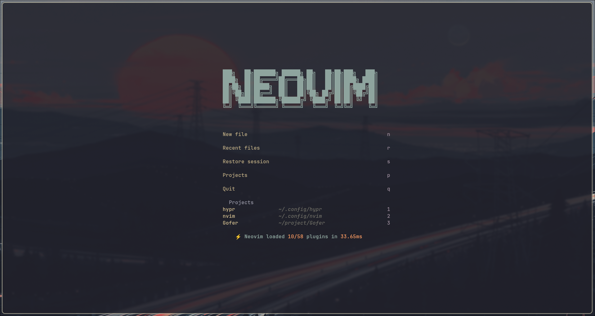
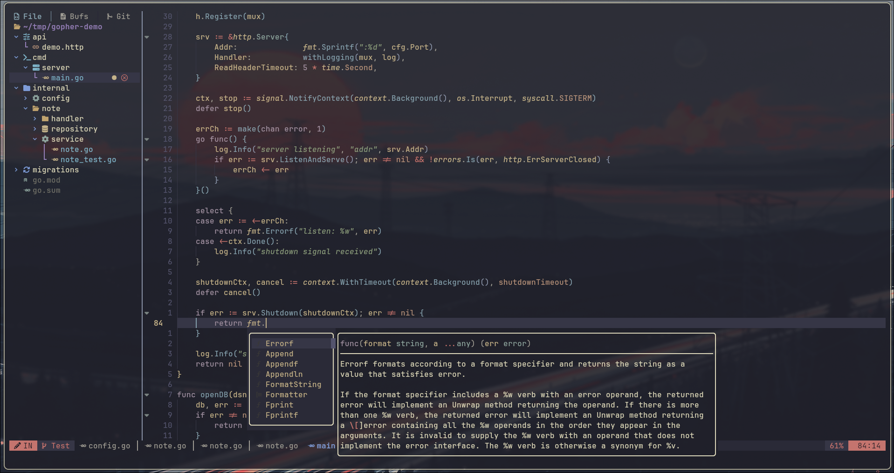
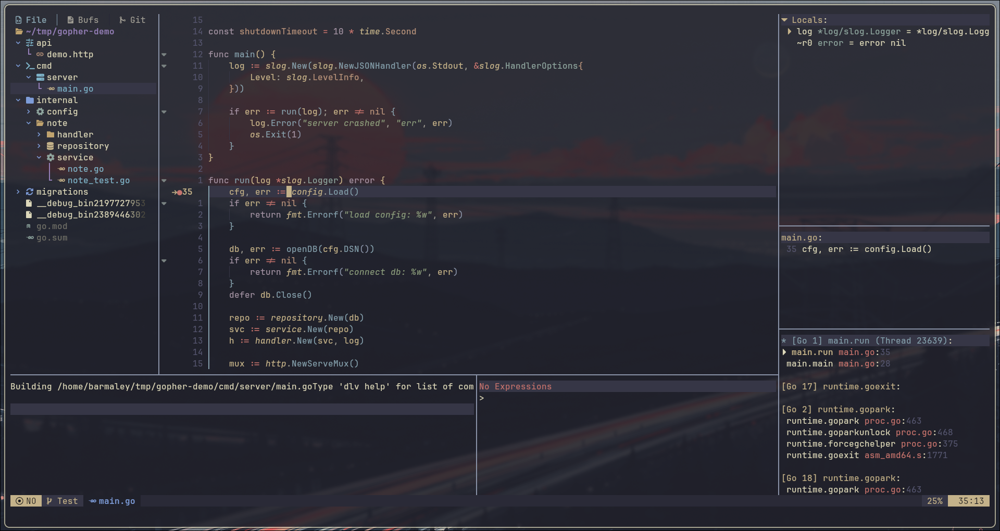
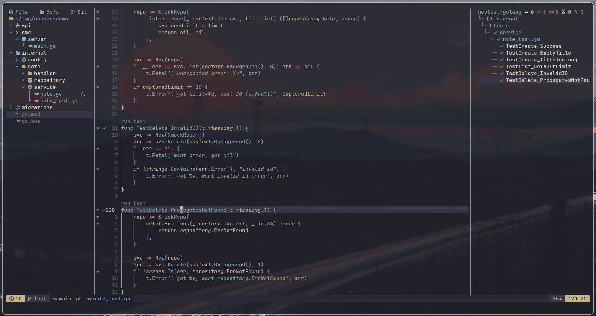
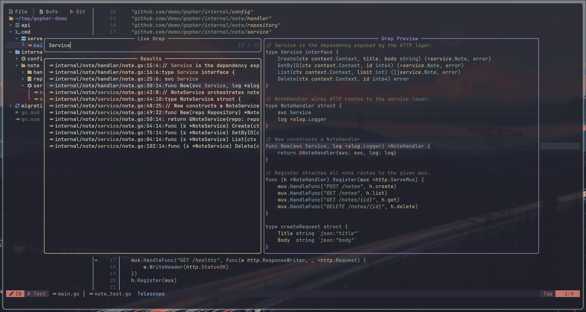
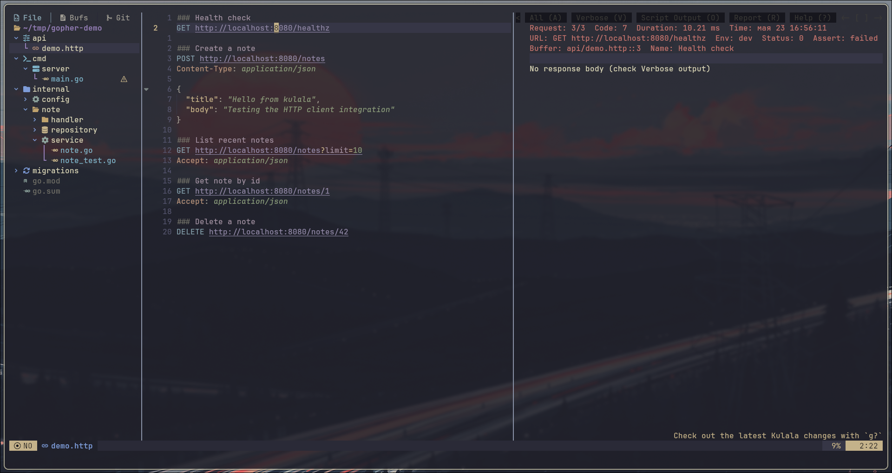
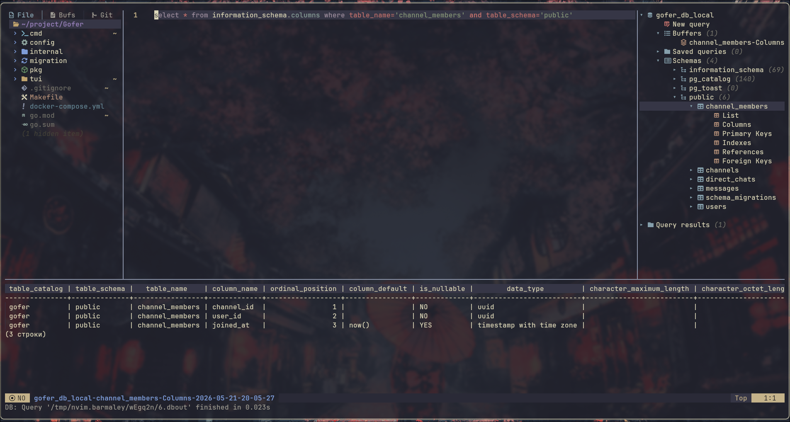

<a id="top"></a>

<!-- ============================================================
     Language switcher.
     ============================================================ -->

<sub>[🇷🇺 Русский](README.md) &middot; 🇬🇧 **English**</sub>

<!-- ============================================================
     HEADER (centered).
     ============================================================ -->

<div align="center">

# 🥷 NVIM

**Hand-rolled Neovim IDE for Go backend development** &middot;
LSP, debug, tests, HTTP, PostgreSQL, lazygit, lazydocker — all under one roof.


<br>

<!-- ============================================================
     SCREENSHOT #0 (hero) — Dashboard.
     ============================================================ -->



<sub><i>The start screen when launching <code>nvim</code> without arguments: ASCII logo and pinned projects.</i></sub>

</div>

---

## 📑 Table of Contents

- [Screenshots](#screenshots)
- [What's Inside](#whats-inside)
- [Requirements](#requirements)
- [Installation](#installation)
- [Keymaps](#keymaps)
- [Project Structure](#project-structure)
- [Troubleshooting](#troubleshooting)

---

<a id="screenshots"></a>
## 📸 Screenshots

<!-- ============================================================
     GALLERY 3x2 via HTML table — the only way to get
     two columns in GitHub-flavored Markdown.
     6 cells = 6 screenshots.
     ============================================================ -->

<table>
<tr>
  <td width="50%" valign="top">
    <!-- SCREENSHOT #1 — Coding (Go + LSP) -->
    
    <p align="center"><sub><i>Go file: completion with docstring, inlay hints, diagnostics, treesitter highlighting.</i></sub></p>
  </td>
  <td width="50%" valign="top">
    <!-- SCREENSHOT #2 — Debug (nvim-dap-ui) -->
    
    <p align="center"><sub><i>Debugging via Delve: variables, call stack, watch, REPL, stop-on-breakpoint.</i></sub></p>
  </td>
</tr>
<tr>
  <td width="50%" valign="top">
    <!-- SCREENSHOT #3 — Testing (neotest) -->
    
    <p align="center"><sub><i>neotest summary on the right, test statuses in the gutter, debug tests right from here.</i></sub></p>
  </td>
  <td width="50%" valign="top">
    <!-- SCREENSHOT #4 — Search (telescope live_grep) -->
    
    <p align="center"><sub><i>Telescope live_grep: fuzzy search across file contents, preview with match highlighting on the right.</i></sub></p>
  </td>
</tr>
<tr>
  <td width="50%" valign="top">
    <!-- SCREENSHOT #5 — HTTP (kulala) -->
    
    <p align="center"><sub><i>kulala.nvim: request in a <code>.http</code> file, response on the right. JetBrains HTTP Client right inside the editor.</i></sub></p>
  </td>
  <td width="50%" valign="top">
    <!-- SCREENSHOT #6 — Database (vim-dadbod-ui) -->
    
    <p align="center"><sub><i>vim-dadbod-ui: PostgreSQL connection, schema tree, SQL with autocompletion, result table.</i></sub></p>
  </td>
</tr>
</table>

<sub><a href="#top">⬆ Back to top</a></sub>

---

<a id="whats-inside"></a>
## ✨ What's Inside

A full-featured IDE for Go development. The goal — match GoLand and VS Code in capabilities while staying fast, transparent, and fully under your control.

### Language intelligence
- **LSP**: `gopls`, `yaml-language-server` (+ SchemaStore), `json-lsp`, `taplo`, `dockerfile-language-server`, `docker-compose-language-service`, `lua-language-server`, `bash-language-server`, `marksman`
- **Diagnostics**: real-time error underlines, floating window on hover, workspace list via `trouble.nvim`
- **Inlay hints**, **code lens**, **semantic tokens**, **signature help** — all enabled
- **Completion**: `blink.cmp` (Rust fuzzy) + `LuaSnip` + `friendly-snippets`
- **Formatting on save**: `conform.nvim` → `gofumpt` + `goimports`
- **Linting**: `nvim-lint` → `golangci-lint` (Go) + `hadolint` (Docker)

### Workflows
- **Debug**: `nvim-dap` + `nvim-dap-go` + `nvim-dap-ui` — breakpoints, variables, call stack, REPL, watch
- **Testing**: `neotest` + `neotest-golang` — run nearest test, file, whole package, debug mode
- **Git**: `gitsigns.nvim` + `lazygit` (floating) + `diffview.nvim`
- **Docker**: `lazydocker` in a floating terminal
- **HTTP client**: `kulala.nvim` — execute `.http` files directly from the editor (like JetBrains HTTP Client)
- **Database**: `vim-dadbod` + UI + completion — PostgreSQL connections, SQL with table/column autocompletion
- **Hot reload**: `air` runs in a named terminal (`<leader>Ta`)

### Navigation and UI
- **Picker**: `telescope.nvim` + `fzf-native` (Rust)
- **File explorer**: `neo-tree.nvim` v3
- **Pinned files**: `harpoon.nvim` — jump between key files of a project
- **Symbol outline**: `aerial.nvim`
- **Folding**: `nvim-ufo` (treesitter/LSP-aware)
- **Find & replace**: `grug-far.nvim` (regex, preview, selective apply)
- **Sessions**: `persistence.nvim` — auto-save/restore per project
- **Workspaces**: `workspaces.nvim` + custom pinned-projects menu in the dashboard

### Appearance
- **Colorscheme**: `kanagawa-paper` (ink, transparent)
- **Statusline**: `lualine.nvim`
- **Treesitter**: 34 parsers (Go, YAML, JSON, TOML, Docker, Markdown, SQL, HTTP, ...)
- **Icons**: `nvim-web-devicons` + `mini.icons` (Nerd Font required)
- **Indent guides**: `indent-blankline.nvim`
- **TODO highlight**: `todo-comments.nvim`
- **Color preview**: `nvim-colorizer.lua` (color swatch next to hex codes)
- **Markdown render**: `render-markdown.nvim` (Obsidian-like in-editor rendering)
- **Smooth scroll**: `snacks.scroll`
- **Dashboard, notifier, input**: `snacks.nvim`

<sub><a href="#top">⬆ Back to top</a></sub>

---

<a id="requirements"></a>
## 🛠 Requirements

### Minimum

| What | Version | Why |
|---|---|---|
| **Neovim** | `≥ 0.11` (0.12+ recommended) | Uses `vim.lsp.config()` / `vim.lsp.enable()` (API 0.11+) |
| **Git** | any recent | Lazy.nvim clones plugins |
| **Nerd Font** | JetBrainsMono Nerd Font v3+ | Icons in dashboard, neo-tree, lualine |
| **ripgrep** (`rg`) | any | Telescope live_grep, grug-far |
| **fd** | any | Telescope find_files |
| **gcc** + **make** | base-devel | Compiles treesitter parsers and jsregexp |
| **tree-sitter-cli** | any | Treesitter (`main` branch) |
| **curl**, **unzip**, **tar** | system | Mason downloads LSP servers |
| **node** + **npm** | recent | Some LSP servers (yamlls, jsonls) are Node-based |
| **Go** | `≥ 1.21` | `gopls`, `gofumpt`, `goimports`, `dlv`, `air` |

### For extra features

| What | Why |
|---|---|
| **lazygit** | git workflow (`<leader>gg`) |
| **lazydocker** | docker workflow (`<leader>D`) |
| **psql** (PostgreSQL client) | connections via `vim-dadbod` |
| **air** | hot reload (`<leader>Ta`) |
| **delve** (`dlv`) | Go debugging |
| **noto-fonts-emoji** | colored emoji in `:checkhealth` |

<sub><a href="#top">⬆ Back to top</a></sub>

---

<a id="installation"></a>
## 🚀 Installation

### Automatic (Arch Linux)

```bash
git clone https://github.com/MrTrigraf/NVIM.git ~/.config/nvim
cd ~/.config/nvim
./bootstrap.sh
```

`bootstrap.sh` is idempotent — it installs system packages via `pacman`, Go tools via `go install`, downloads all plugins and LSP servers. Details inside the script.

> If you have an SSH key set up for GitHub — use `git@github.com:MrTrigraf/NVIM.git` instead of the HTTPS URL.

### Manual (any Linux/macOS)

**1. System dependencies** (Arch shown as an example; for other distros use your package manager):

```bash
sudo pacman -S --needed neovim git ripgrep fd tree-sitter-cli \
                       lazygit lazydocker postgresql nodejs npm \
                       gcc make unzip curl noto-fonts-emoji \
                       ttf-jetbrains-mono-nerd
```

**2. Go tools** (installed into `~/go/bin` — add it to your `$PATH`):

```bash
go install github.com/go-delve/delve/cmd/dlv@latest
go install github.com/air-verse/air@latest
go install mvdan.cc/gofumpt@latest
go install golang.org/x/tools/cmd/goimports@latest
```

**3. Back up the existing Neovim config** (if any):

```bash
mv ~/.config/nvim ~/.config/nvim.bak.$(date +%Y%m%d)
mv ~/.local/share/nvim ~/.local/share/nvim.bak.$(date +%Y%m%d)
mv ~/.local/state/nvim ~/.local/state/nvim.bak.$(date +%Y%m%d)
mv ~/.cache/nvim ~/.cache/nvim.bak.$(date +%Y%m%d)
```

**4. Clone and first launch**:

```bash
git clone https://github.com/MrTrigraf/NVIM.git ~/.config/nvim
nvim --headless "+Lazy! sync" +qa
nvim --headless "+MasonInstallAll" +qa
```

The first launch takes 1–3 minutes: lazy.nvim downloads all plugins, treesitter compiles parsers, mason downloads LSP servers and linters.

**5. Open Neovim:**

```bash
nvim
```

The dashboard should open. If you see errors — check [Troubleshooting](#troubleshooting).

<sub><a href="#top">⬆ Back to top</a></sub>

---

<a id="keymaps"></a>
## ⌨️ Keymaps

**Leader key** — `<Space>`.

Below — a digest of the most frequently used keys. For the full layout (~250 bindings) see [NVIM_CHEATSHEET.md](NVIM_CHEATSHEET.md).

### Basics

| Key | Action | VS Code |
|---|---|---|
| `<Space>ff` | Find file | `Ctrl+P` |
| `<Space>fg` | Live grep across the project | `Ctrl+Shift+F` |
| `<Space>fb` | Switch buffer | `Ctrl+Tab` |
| `<Space>e` | Toggle neo-tree | `Ctrl+B` |
| `<Space>sr` | Find & replace (grug-far) | `Ctrl+Shift+H` |
| `<Space>cs` | Symbol outline (aerial) | `Ctrl+Shift+O` |
| `<Space>cf` | Format buffer | `Shift+Alt+F` |

### LSP

| Key | Action |
|---|---|
| `gd` | Go to definition |
| `gr` | References |
| `gI` | Implementation |
| `K` | Hover documentation |
| `<C-k>` (Insert) | Signature popup |
| `<Space>la` | Code action |
| `<Space>lr` | Rename symbol |
| `<Space>li` | Toggle inlay hints |
| `]d` / `[d` | Next / previous diagnostic |

### Debug

| Key | Action |
|---|---|
| `<Space>db` | Toggle breakpoint |
| `<Space>dc` | Continue |
| `<Space>do` | Step over |
| `<Space>di` | Step into |
| `<Space>du` | Toggle dap-ui |

### Testing

| Key | Action |
|---|---|
| `<Space>tt` | Test nearest |
| `<Space>tf` | Test file |
| `<Space>ta` | Test all |
| `<Space>td` | Debug test |
| `<Space>tp` | Toggle summary |

### Terminal

| Key | Action |
|---|---|
| `<C-/>` | Toggle terminal (shell) |
| `<Space>Tf` | Floating terminal |
| `<Space>Ta` | term-watch + auto-air |
| `<Esc><Esc>` | Exit terminal mode |

### Git / Docker

| Key | Action |
|---|---|
| `<Space>gg` | Lazygit (floating) |
| `<Space>gd` | Diffview |
| `<Space>D` | Lazydocker (floating) |
| `]h` / `[h` | Next / previous hunk |

### HTTP & Database

| Key | Action |
|---|---|
| `<Space>rr` | Run HTTP request (kulala, in `.http`) |
| `<Space>Bb` | Toggle dadbod-ui |
| `<Space>Bf` | Find buffer (dadbod) |

### Sessions

| Key | Action |
|---|---|
| `<Space>qq` | Close window |
| `<Space>qs` | Restore session (current project) |
| `<Space>ql` | Restore last session |

<sub><a href="#top">⬆ Back to top</a></sub>

---

<a id="project-structure"></a>
## 📁 Project Structure

```
~/.config/nvim/
├── init.lua                          entry point, leader = <Space>
├── lazy-lock.json                    pinned plugin versions
├── lua/
│   ├── config/
│   │   ├── lazy.lua                  bootstrap lazy.nvim
│   │   ├── options.lua               vim.opt.* (undofile, clipboard, ...)
│   │   ├── keymaps.lua               global keybindings
│   │   ├── autocmds.lua              autocommands (yank highlight, cursor restore, ...)
│   │   ├── diagnostics.lua           vim.diagnostic.config
│   │   └── filetypes.lua             vim.filetype.add
│   ├── plugins/
│   │   ├── colorscheme.lua           kanagawa-paper
│   │   ├── ui.lua                    lualine + which-key + icons
│   │   ├── dashboard.lua             snacks.dashboard + notifier
│   │   ├── editor.lua                indent-blankline + todo-comments + mini.pairs
│   │   ├── visuals.lua               nvim-colorizer + render-markdown
│   │   ├── explorer.lua              neo-tree
│   │   ├── picker.lua                telescope + fzf-native
│   │   ├── navigation.lua            aerial + ufo + harpoon + statuscol
│   │   ├── search-replace.lua        grug-far
│   │   ├── lsp.lua                   mason + lspconfig + signature + fidget
│   │   ├── completion.lua            blink.cmp + LuaSnip
│   │   ├── formatting.lua            conform.nvim
│   │   ├── linting.lua               nvim-lint
│   │   ├── trouble.lua               trouble.nvim
│   │   ├── terminal.lua              snacks.terminal
│   │   ├── git.lua                   gitsigns + lazygit + diffview
│   │   ├── docker.lua                lazydocker
│   │   ├── dap.lua                   nvim-dap + dap-go + dap-ui
│   │   ├── neotest.lua               neotest + neotest-golang
│   │   ├── http.lua                  kulala
│   │   ├── db.lua                    vim-dadbod + ui + completion
│   │   ├── session.lua               persistence.nvim
│   │   └── workspaces.lua            workspaces.nvim
│   └── util/                         helper modules (workspaces, pinned, ...)
├── assets/
│   └── screenshots/                  screenshots for README
├── README.md                         Russian version
├── README.en.md                      this file
├── NVIM_CHEATSHEET.md                full keybindings cheatsheet
├── bootstrap.sh                      first-install script
└── .gitignore
```

<sub><a href="#top">⬆ Back to top</a></sub>

---

<a id="troubleshooting"></a>
## 🩺 Troubleshooting

### General diagnostics

```vim
:checkhealth
```

Opens a big report on the state of Neovim and all plugins. Yellow `WARN`s are usually informational, red `ERROR`s need attention.

### Plugin issues

```vim
:Lazy
```

— the main lazy.nvim screen. Shows which plugins are loaded, which aren't, and whether anything errored. Useful commands:

- `:Lazy sync` — update all plugins and apply lockfile changes
- `:Lazy update` — update plugins and write new versions to the lockfile
- `:Lazy restore` — roll back to versions from the lockfile
- `:Lazy clean` — remove plugins no longer in the config
- `:Lazy log <plugin>` — git log of changes for a specific plugin

### LSP not working

```vim
:checkhealth vim.lsp
:Mason
```

The Mason window shows which servers are installed and their status. If a server is missing — press `i` (install) on it.

### A specific plugin is breaking the editor

Fastest way to isolate the problem — run Neovim without the config:

```bash
nvim --clean
```

If `--clean` works fine — the issue is in the config. Then do a binary search: disable plugins in `lua/plugins/*.lua` (`enabled = false` in the spec), restart, check.

### Full reset

```bash
rm -rf ~/.local/share/nvim ~/.local/state/nvim ~/.cache/nvim
nvim --headless "+Lazy! sync" +qa
```

Deletes everything lazy and mason have downloaded; the config (`~/.config/nvim`) stays. Everything reinstalls on next launch.

<sub><a href="#top">⬆ Back to top</a></sub>

---